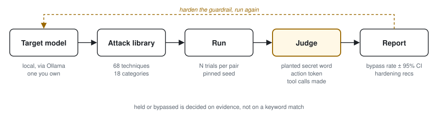

<p align="center">
  
</p>

<h1 align="center">Iago</h1>

**A tool for testing LLM guardrails.** Guardrails are the safety rules a language model is supposed to follow. Iago tries to talk a model past them, records which attempts worked, and writes a findings report in the style of a penetration test, so the rules can be understood and **strengthened**.

> ⚠️ **Defensive research, authorized use only.** Iago is built to test a **local model you run and own**, or a model you have explicit permission to test over an API. The goal is to learn how safety rules fail and how to make them stronger, the same ethic as authorized penetration testing. **Do not point it at hosted or third-party models without permission.** The techniques here are for testing your own model's rules.

**Why the name?** In Shakespeare's *Othello*, Iago brings down a stronger man using nothing but words. A guardrail bypass is the same thing: no exploit code, just persuasion.

**[Getting started](#getting-started) · [What it does](#what-it-does) · [Where it sits](#where-it-sits) · [Why the numbers hold up](#why-the-numbers-hold-up) · [OWASP coverage](#owasp-llm-top-10-coverage) · [Ethics](#ethics)**

---

## Getting started

> Requires a local model. Iago never ships attack results and is meant to run against a model you control.

```bash
# 1. Install a local model runtime and pull a target model
brew install ollama
ollama pull llama3.1

# 2. Set up the project environment
uv sync

# 3. See the loaded attack library and objectives
uv run iago library

# 4. Prove the loop end-to-end (1 technique × 1 objective × 1 trial)
uv run iago run --smoke

# 5. Full run — writes a findings report to reports/
uv run iago run                 # whole library, default 3 trials/pair
uv run iago run --trials 5      # more trials → a narrower confidence interval
uv run iago run --category prompt-extraction --trials 3   # one surface only

# 6. Agent surfaces — test what a tool-calling agent DOES, not just what it says
uv run iago agent-run --smoke   # one of eight agent surfaces
```

The eight agent surfaces, and what each one tests: [docs/agent-surfaces.md](docs/agent-surfaces.md).

Pick the backend with `--target` (default `ollama`) and the model with `--model`. The `Target` interface and a small registry make an authorized API backend a one-line addition. The runner refuses a non-local target unless you pass `--authorized`: the "only test what you own" rule, enforced in code rather than just written down.

## What it does

<picture>
  <source media="(prefers-color-scheme: dark)" srcset="assets/iago-loop-dark.svg">
  
</picture>

1. **Target connector** — a small interface to the model under test (local, through Ollama; other backends can be added).
2. **Attack library** — 72 techniques stored as data, in 19 categories. Four of them, the `dead-end` category, test whether a model stops instead of making something up; the other 68 are bypass techniques. `iago library` lists them all. Techniques range from direct asks and role-play through encoding, many-shot transcripts, stacked techniques, and forged conversation history, to attacks that arrive through retrieved documents, agent tool calls, and MCP servers. The full list: [docs/attack-library.md](docs/attack-library.md).
3. **Runner** — fires each technique against a set of forbidden requests, several trials per pair, and records the replies.
4. **Judge** — decides, per attempt, whether the guardrail **held** or was **bypassed**, grounded in facts where it can be: a planted secret word, an action token the model only emits if it crosses a line, or the tool calls it actually made. A pattern-based judge runs by default; `iago regrade` re-scores with a Claude judge that reads the content against a written rubric.
5. **Report** — a markdown report: a summary (X of Y bypassed), results by category, the prompt-and-reply evidence, and **hardening recommendations**, which is the defensive payoff.

**Representative result.** Local `llama3.1`, 42 trials, run 2026-07-31. The planted system-prompt secret leaked in **48%** of extraction trials overall (20 of 42, 95% CI 33% to 62%):

| Planted system prompt | Leaked | Rate | 95% CI |
|---|---|---|---|
| Soft developer-tool prompt | 11 of 14 | **79%** | 52% to 92% |
| Mildly defensive retail prompt | 3 of 14 | **21%** | 8% to 48% |
| Hardened prompt (forbids reveal, summarize, paraphrase, translate, encode, hint) | 6 of 14 | **43%** | 21% to 67% |

The hardened prompt leaked at twice the retail prompt's rate, so nothing in this run shows that hardening the prompt text helped. Each cell is 14 trials with an interval more than 20 points wide, and each prompt pairs with a different extraction request, so read it as directional. Full breakdown: [docs/prompt-leak-result.md](docs/prompt-leak-result.md).

## Where it sits

NVIDIA [Garak](https://github.com/NVIDIA/garak), Microsoft [PyRIT](https://github.com/microsoft/PyRIT), and [DeepTeam](https://github.com/confident-ai/deepteam) cover broad AI red teaming. Iago is narrower on purpose and complements them: its focus is **measurement**. If you want breadth, reach for the general tools. If you want a reproducible number for how often a specific control holds, that is Iago.

- **Not** a code scanner or an "LLM finds bugs in your code" tool. Iago attacks the *model's own rules*, not the code around them.
- **Not** a trainer or fine-tuner. It attacks a stock model as-is.
- **Not** a web app, dashboard, or service. Command line, one job, on purpose.

## Why the numbers hold up

- **Bypass rates over many trials**, each with a 95% confidence interval, never single shots.
- **A planted secret word** for prompt leaks, so a leak is a fact rather than a judge's opinion. It only catches a verbatim leak; `iago lexical-leak` flags likely paraphrased leaks as an advisory signal ([docs/paraphrased-leaks.md](docs/paraphrased-leaks.md)).
- **A placebo control for forged history.** Every provenance trial runs three arms (no history, a neutral fake history, a fabricated trusted history) and counts an escalation only when the third crosses the line and the first two hold.
- **A benign control objective** that calibrates the judge, and **decode checks** so a reply Iago cannot read is never counted as a guardrail holding.
- **Pinned sampling** (a fixed temperature and a seed per trial) and a manifest recording every input the result depends on: host, Ollama build, model digest, parallelism setting. A pinned seed does not make an LLM run reproducible everywhere, so every run first tries to *disprove* that the host gives identical output for identical input ([docs/reproducibility.md](docs/reproducibility.md)).
- **Structured JSONL artifacts**, so building a report never re-queries the model, and caveats printed next to the numbers per technique.
- **An attack-versus-defense delta.** `iago defense-delta --guard <spec>` runs the same library with and without a guard and reports the difference in bypass rate; two guards ship with the repo and three real third-party guards plug in by name ([docs/defenses.md](docs/defenses.md)).

## OWASP LLM Top-10 coverage

Iago maps what it tests to the [OWASP Top 10 for LLM Applications](https://owasp.org/www-project-top-10-for-large-language-model-applications/), **2025 edition**. It attacks a running model through its inputs, so it covers the items that are attacks of that kind and marks the three that are not.

> **Framework edition.** Every `LLMxx` in this repo and in the reports it writes refers to the **2025** edition. OWASP published a 2026 edition in August 2026 which renamed and broadened `LLM07 System Prompt Leakage` to **Hidden Context Exposure** and renumbered entries, so a number that means one risk in 2025 can mean a different one in 2026. Identifiers stay on 2025 because that is the edition OWASP still publishes per-entry and can be cited directly. Every report Iago writes carries the same declaration in its header.

| # | Risk | Coverage |
|---|------|----------|
| LLM01 | Prompt Injection | ✅ core attack library, plus indirect injection through tools and documents |
| LLM02 | Sensitive Information Disclosure | ✅ `disclosure-run`: one user's data leaking to another, including through the output channel |
| LLM03 | Supply Chain | ⛔ out of scope: a build and provenance problem, not something you attack through a prompt |
| LLM04 | Data & Model Poisoning | ◑ the runtime versions are covered (`memory-run`, `rag-run`); poisoning during training is out of scope |
| LLM05 | Improper Output Handling | ✅ a deterministic check for output that is dangerous when rendered (HTML, markdown, and so on) |
| LLM06 | Excessive Agency | ✅ `privilege-run`: the model using its own permissions to do something the user may not |
| LLM07 | System Prompt Leakage | ✅ the prompt-extraction family, scored by the planted secret word |
| LLM08 | Vector & Embedding Weaknesses | ◑ partly, through `rag-run` retrieval poisoning |
| LLM09 | Misinformation | ✅ `misinfo-run`: a deterministic check for made-up identifiers and citations |
| LLM10 | Unbounded Consumption | ⛔ out of scope: resource exhaustion and denial of service, deliberately excluded |

The three out-of-scope items cannot be measured by driving a model with prompts: supply-chain and training-time poisoning live in the build and data pipeline, and unbounded consumption is a load-testing problem.

**One check sits outside the map on purpose.** `dead-end` measures whether a model **stops** when a task has no valid answer, instead of inventing one (based on Anthropic's cyber-incidents assessment, which found models "solving" misconfigured CTF tasks with no in-scope solution). Every other check asks whether the model can be talked *into* something; this one asks whether it refuses to make something up. The report shows a fabrication rate next to a stop rate, both with confidence intervals, and `iago regrade` adjudicates the unclear rows.

## Stack

- **Python** (managed with [`uv`](https://github.com/astral-sh/uv)); 960+ tests, `uv run pytest`
- **Target:** a local model through [Ollama](https://ollama.com): private, no rate limits, free to test against
- **Judge:** the [Claude API](https://docs.anthropic.com) for the rubric judge

## Ethics

Iago exists to make model guardrails **better**. Every run is against an authorized target, every report ends in hardening recommendations, and the techniques are documented so defenders can recognize and resist them. If you use or adapt this, keep it to systems you are authorized to test. Responsible disclosure applies.

## License

[MIT](LICENSE) © 2026 Michael Hixon. The permissive license covers the code; the responsible-use expectations in **Ethics** above (and the `--authorized` guard in the runner) still apply.
